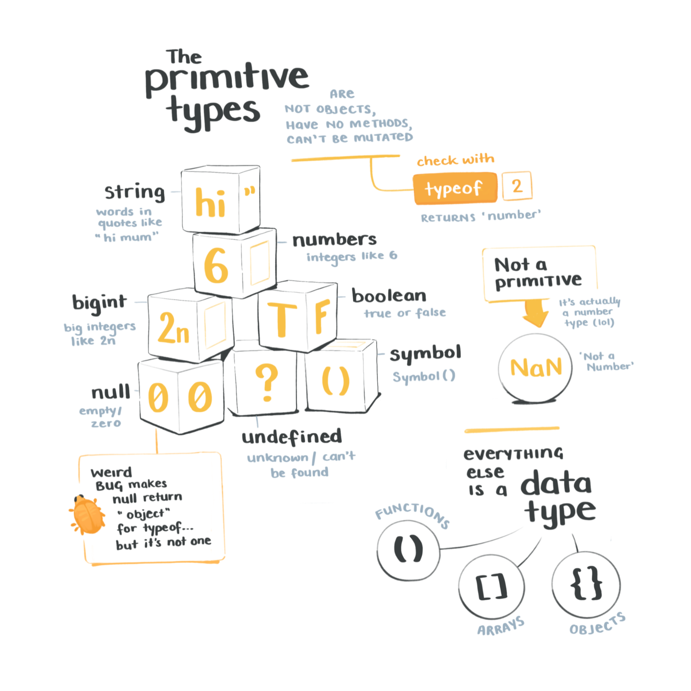
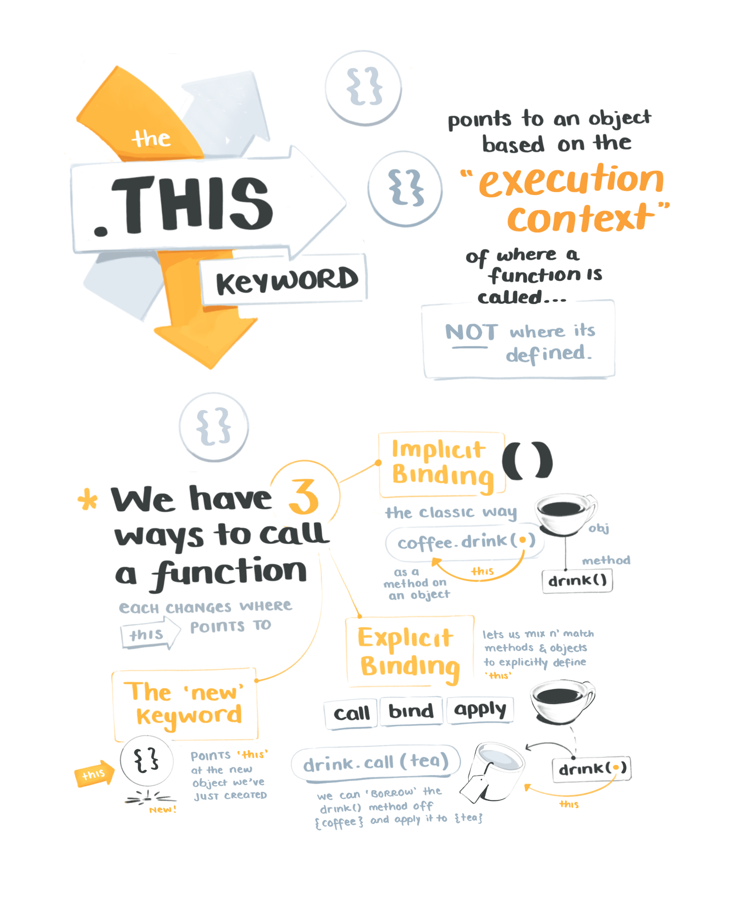
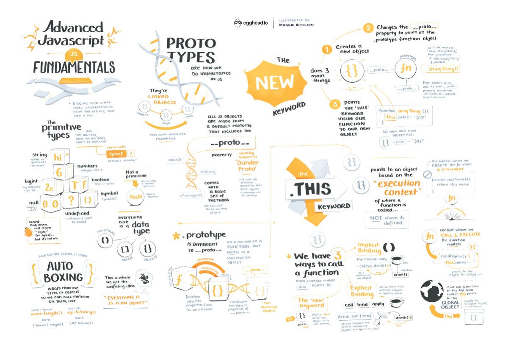

import FullSketchnote from '../../../src/components/mdx/FullSketchnote.js'
import SketchesContainer from '../../../src/components/mdx/SketchesContainer.js'

<SketchesContainer>

Fluff fluff fluff

Fluff fluff fluff

Fluff fluff fluff

---

<FullSketchnote coursename="Build Web Apps with Gatsby and Contentful" courselink="http://bit.ly/advanjs">

</FullSketchnote>

</SketchesContainer>