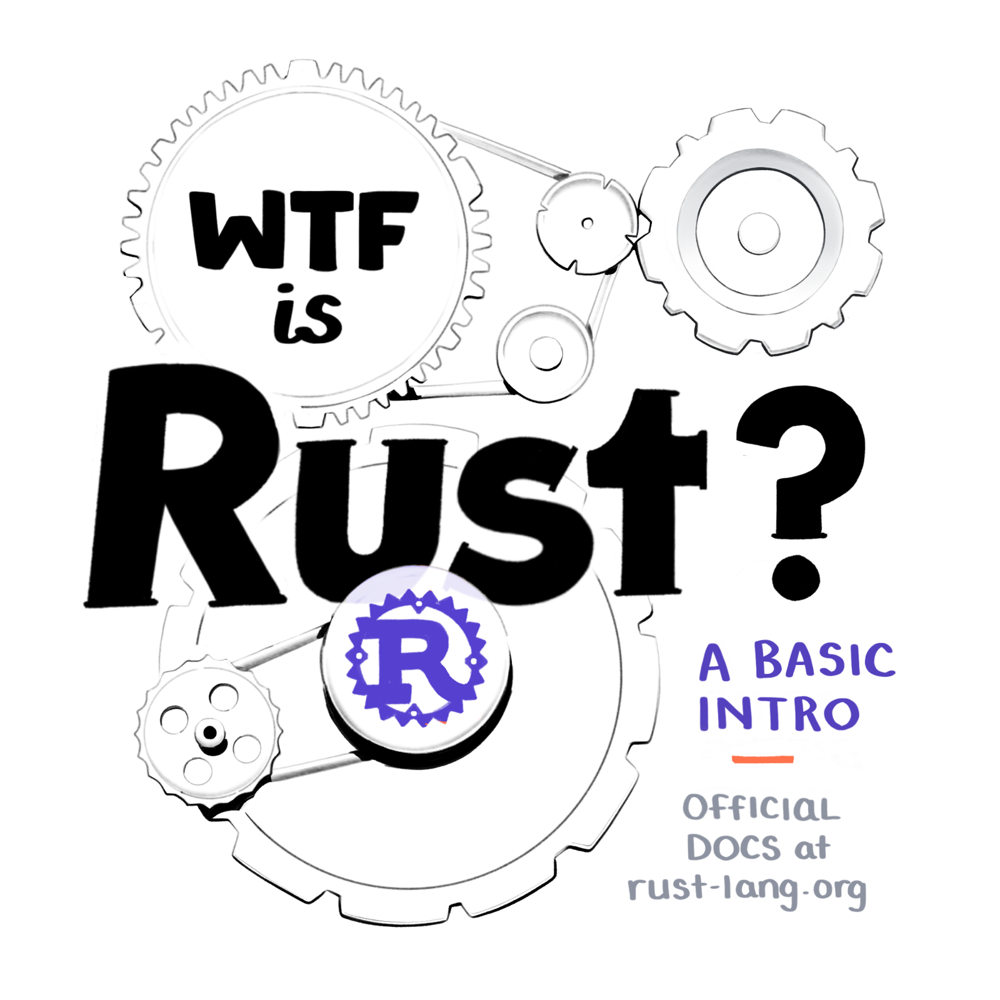
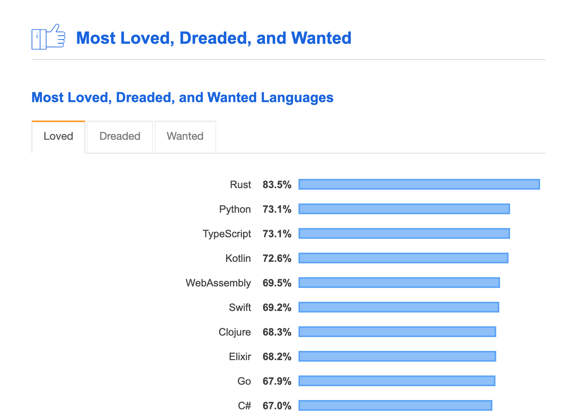
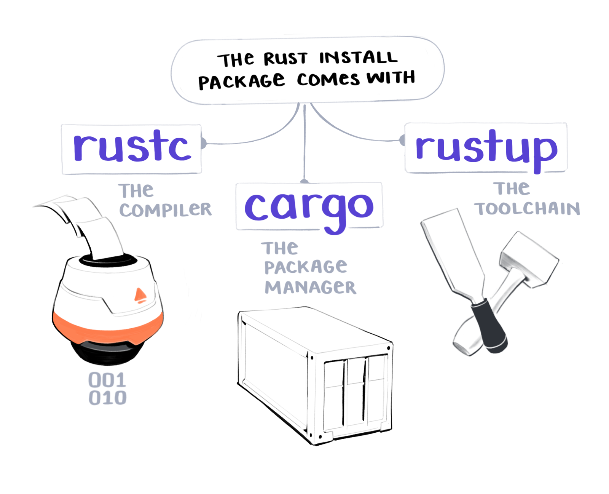
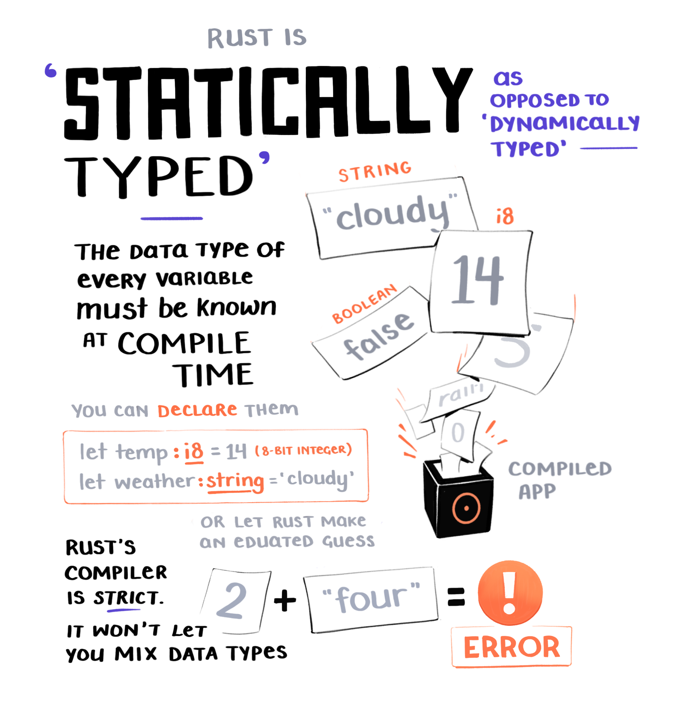
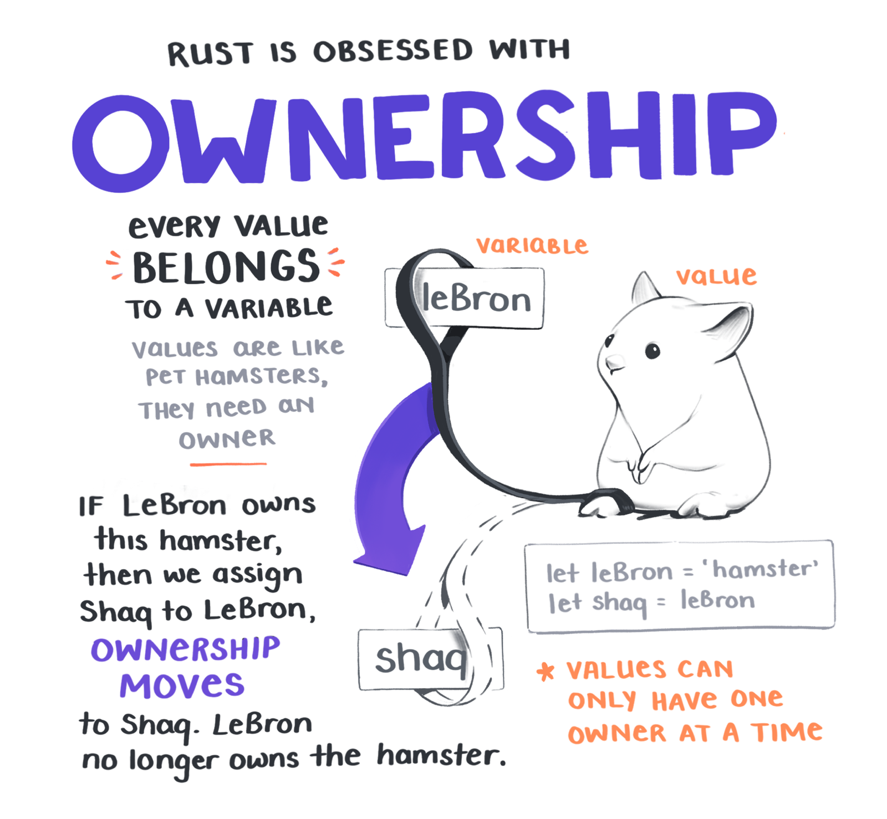

<NotesContainer>

---

The <Link to="https://www.rust-lang.org/">Rust programming language</Link> keeps winning the middle-school popularity contest of the developer world: "most loved" on <Link to="https://insights.stackoverflow.com/survey/2019#technology">Stack Overflow surveys</Link>.

---

So, what's this Rust thing and why is everyone enamoured?  
Let's explore...

This happy balance Rust manages to strike - between speed, control over some memory storage, and being developer-friendly to 

https://egghead.io/courses/write-your-first-program-with-the-rust-language

</NotesContainer>