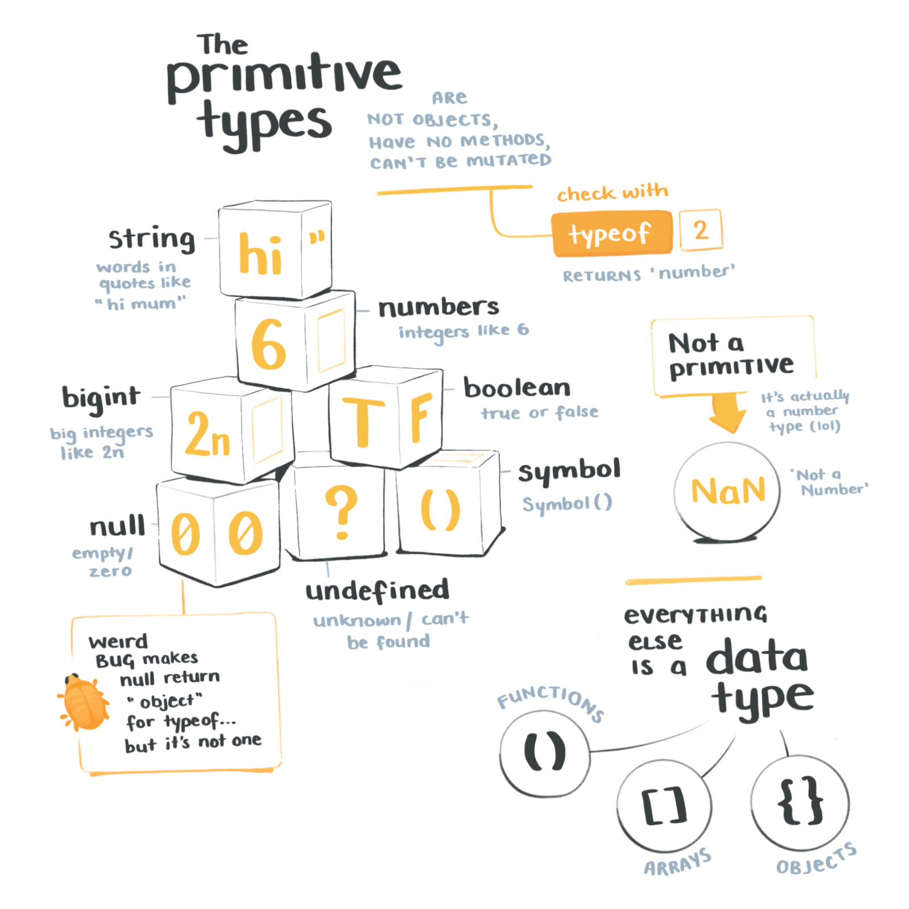
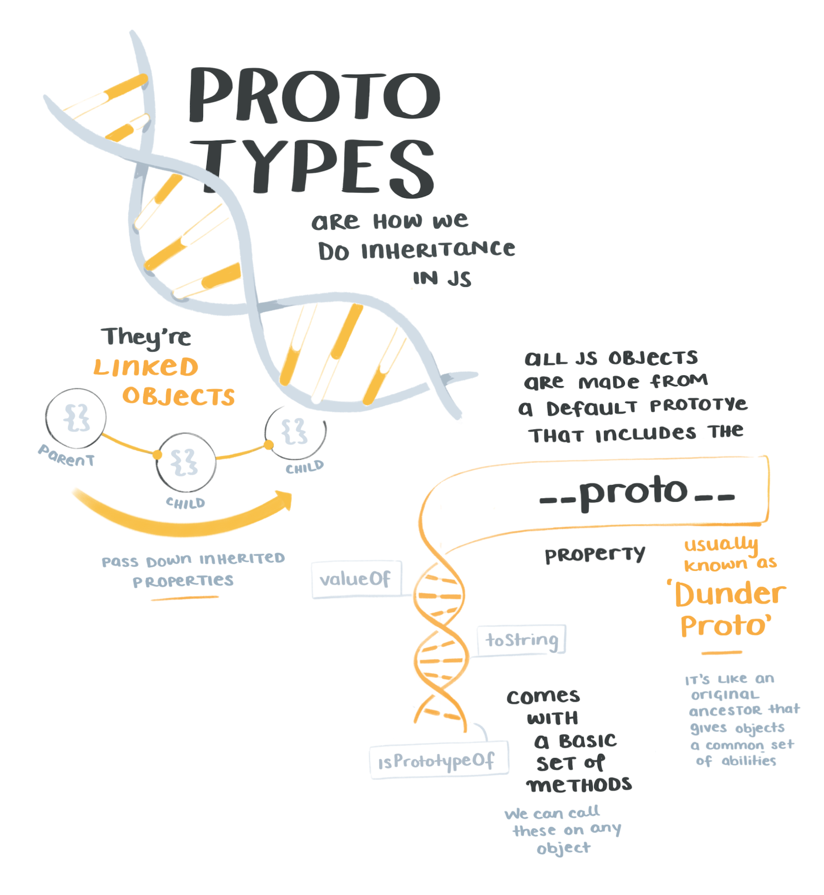
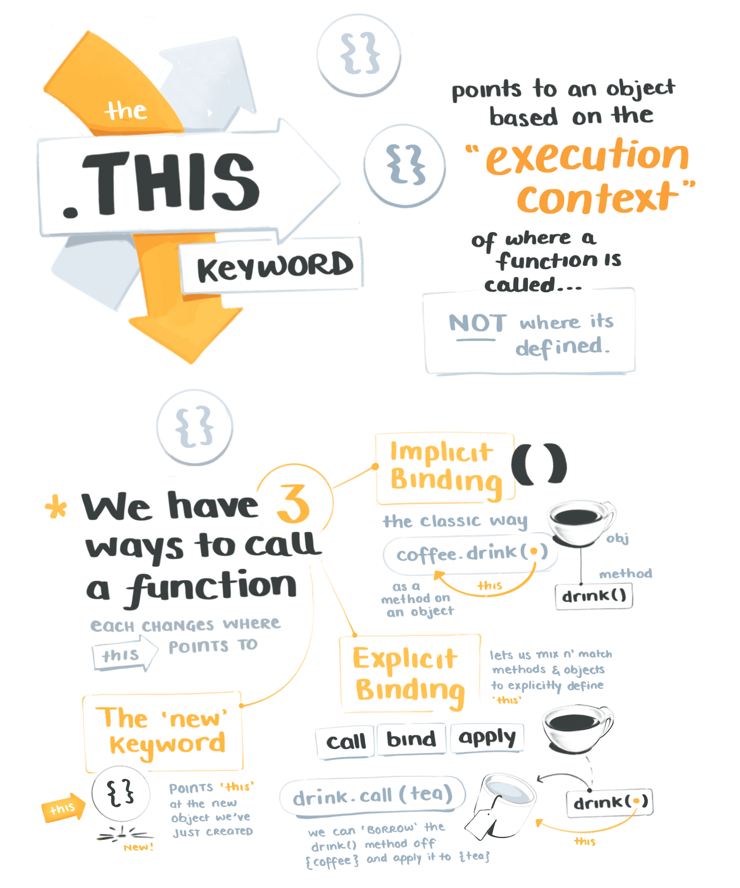
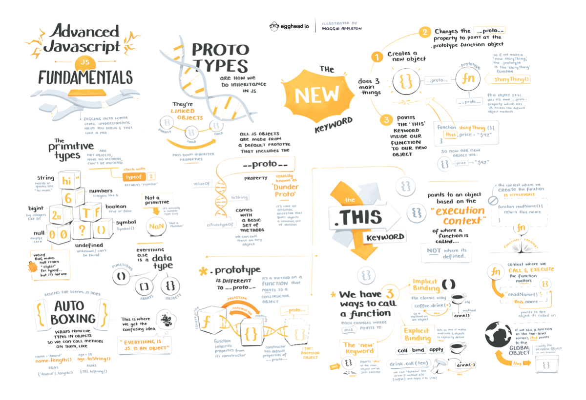

import FullSketchnote from '../../../src/components/mdx/FullSketchnote.js'
import SketchesContainer from '../../../src/components/mdx/SketchesContainer.js'

<SketchesContainer>

Being humans, we rarely learn things linearly.  
No one begins their JavaScript journey by reading [the TC39 language specification](https://www.ecma-international.org/ecma-262/5.1/) line-by-line like a pedantic masochist.

Instead we all cobble together a good-enough understanding, leaving holes here and there to fill in later.

But at some point, you need to peek back at those holes.

[Tyler Clark](https://twitter.com/iamtylerwclark)'s latest course on [Advanced JavaScript Foundations](https://egghead.io/courses/advanced-javascript-foundations?rc=272bjb) is exactly that hole-filling opportunity.

Tyler runs through all the details that are usually skipped over in beginners tutorials. The ones that make a huge difference when you're deep in a debugging session, and can't figure out where the f🍪🍩k `this` is pointing and why all your results are `undefined`.

So far I've stumbled along without 100% grokking `this` or prototypical inheritance.
It's fine. Stuff mostly works. Until it doesn't  ¯\_(ツ)_/¯
Thankfully, I'm a lot less hesitant and stumbley after making these notes. 

The hardest thing about JavaScript is not knowing JavaScript.

Fluff fluff fluff

Fluff fluff fluff

---

<FullSketchnote coursename="Advanced JavaScript Fundamentals" courselink="http://bit.ly/advanjs">

</FullSketchnote>

</SketchesContainer>