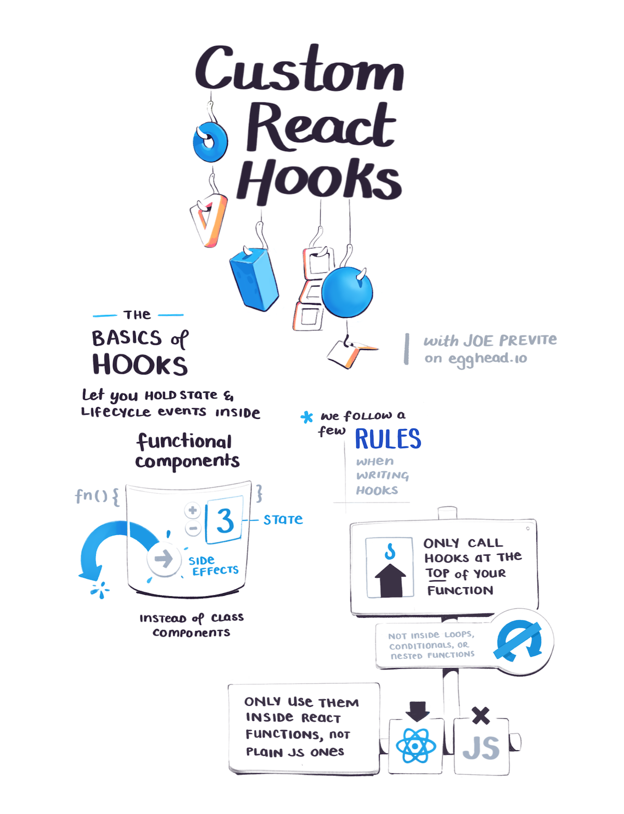
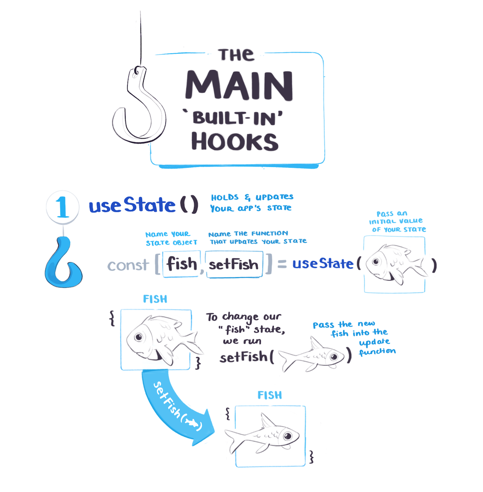

import FullSketchnote from '../../../src/components/mdx/FullSketchnote.js'
import SketchesContainer from '../../../src/components/mdx/SketchesContainer.js'
import Link from '../../../src/components/link.js'

<SketchesContainer>

---

<FullSketchnote coursename="Shareable Custom Hooks in React" courselink="#">

</FullSketchnote>

</SketchesContainer>